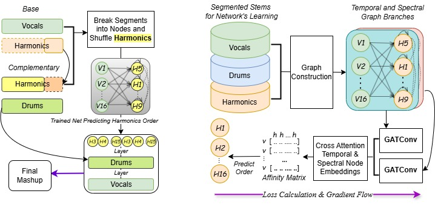

<html lang="en">
<head>
    <meta charset="UTF-8">
    <meta name="viewport" content="width=device-width, initial-scale=1.0">
    <title>Research Output Demos</title>
    <!-- Add CSS for Flexbox and Styling -->
    
</head>

<body>

  This is the page showcasing some of my research topics' output demos,
  for my creative works:
  (<a href="https://shinxinyangdemo.github.io" target="_blank">
  shinxinyangdemo.github.io</a>)

<!-- ✅ First Section: Dominant-Note–Conditioned Generation & Editing (Pilot) -->

  <h1>Dominant-Note–Conditioned Generation & Editing
    <small>(pilot results; work in progress)</small>
  </h1>
  

    Pilot results for music <b>generating</b> and <b>editing</b> models,
    conditioned on the dominant note. Still work in progress…
  

  

    <figure class="video-item">
      <video controls preload="metadata" playsinline>
        <source src="generate_2.mp4" type="video/mp4">
        Your browser does not support the video tag.
      </video>
      <figcaption><b>Generating</b>: dominant-note conditioned music generation.</figcaption>
    </figure>

    <figure class="video-item">
      <video controls preload="metadata" playsinline>
        <source src="edit_2.mp4" type="video/mp4">
        Your browser does not support the video tag.
      </video>
      <figcaption><b>Editing</b>: inversion-based editing guided by the same dominant-note condition.</figcaption>
    </figure>
  

    <!-- First Section: GNN Guided Mashup Generation -->
    

        <h1>Graph Neural Network Guided Music Mashup Generation</h1>

<!-- Audio Rows -->

    

        <h3>Original 1</h3>
        <audio controls>
            <source src="original_1.wav" type="audio/wav">
            Your browser does not support the audio element.
        </audio>
    

    

        <h3>Original 2</h3>
        <audio controls>
            <source src="original_12.wav" type="audio/wav">
            Your browser does not support the audio element.
        </audio>
    

    

        <h3>Mashup 1</h3>
        <audio controls>
            <source src="mashup_1.wav" type="audio/wav">
            Your browser does not support the audio element.
        </audio>
    

    

        <h3>Original 1</h3>
        <audio controls>
            <source src="original_2.wav" type="audio/wav">
            Your browser does not support the audio element.
        </audio>
    

    

        <h3>Original 2</h3>
        <audio controls>
            <source src="original_22.wav" type="audio/wav">
            Your browser does not support the audio element.
        </audio>
    

    

        <h3>Mashup 2</h3>
        <audio controls>
            <source src="mashup_2.wav" type="audio/wav">
            Your browser does not support the audio element.
        </audio>
    

    

        <h3>Original 1</h3>
        <audio controls>
            <source src="original_3.wav" type="audio/wav">
            Your browser does not support the audio element.
        </audio>
    

    

        <h3>Original 2</h3>
        <audio controls>
            <source src="original_32.wav" type="audio/wav">
            Your browser does not support the audio element.
        </audio>
    

    

        <h3>Mashup 3</h3>
        <audio controls>
            <source src="mashup_3.wav" type="audio/wav">
            Your browser does not support the audio element.
        </audio>
    

    

        <h3>Original 1</h3>
        <audio controls>
            <source src="original_4.wav" type="audio/wav">
            Your browser does not support the audio element.
        </audio>
    

    

        <h3>Original 2</h3>
        <audio controls>
            <source src="original_42.wav" type="audio/wav">
            Your browser does not support the audio element.
        </audio>
    

    

        <h3>Mashup 4</h3>
        <audio controls>
            <source src="mashup_4.wav" type="audio/wav">
            Your browser does not support the audio element.
        </audio>
    

    

        <h3>Original 1</h3>
        <audio controls>
            <source src="original_5.wav" type="audio/wav">
            Your browser does not support the audio element.
        </audio>
    

    

        <h3>Original 2</h3>
        <audio controls>
            <source src="original_52.wav" type="audio/wav">
            Your browser does not support the audio element.
        </audio>
    

    

        <h3>Mashup 5</h3>
        <audio controls>
            <source src="mashup_5.wav" type="audio/wav">
            Your browser does not support the audio element.
        </audio>
    

Original 1 provides the vocals and instrumentals, original 2 provides the instrumentals, the mashup instrumental is rearranged through the network which is a fusion of both originals

   

    

    <!-- Second Section: Diffusion Models for Automatic Music Mixing -->
    

        <h1>Diffusion Models for Automatic Music Mixing</h1>

        <!-- Audio Rows -->
        

            

                <h3>Imbalanced Input 1</h3>
                <audio controls>
                    <source src="imbalanced_input_1.wav" type="audio/wav">
                    Your browser does not support the audio element.
                </audio>
            

            

                <h3>Diffusion Mix 1</h3>
                <audio controls>
                    <source src="diffusion_mix_1.wav" type="audio/wav">
                    Your browser does not support the audio element.
                </audio>
            

        

        

            

                <h3>Imbalanced Input 2</h3>
                <audio controls>
                    <source src="imbalanced_input_2.wav" type="audio/wav">
                    Your browser does not support the audio element.
                </audio>
            

            

                <h3>Diffusion Mix 2</h3>
                <audio controls>
                    <source src="diffusion_mix_2.wav" type="audio/wav">
                    Your browser does not support the audio element.
                </audio>
            

        

        

            

                <h3>Imbalanced Input 3</h3>
                <audio controls>
                    <source src="imbalanced_input_3.wav" type="audio/wav">
                    Your browser does not support the audio element.
                </audio>
            

            

                <h3>Diffusion Mix 3</h3>
                <audio controls>
                    <source src="diffusion_mix_3.wav" type="audio/wav">
                    Your browser does not support the audio element.
                </audio>
            

        

    

    
<h1>End</h1>

</body>
</html>
